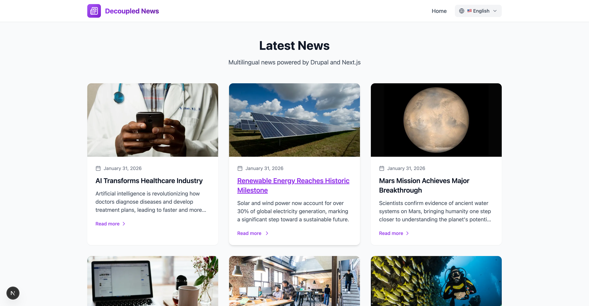
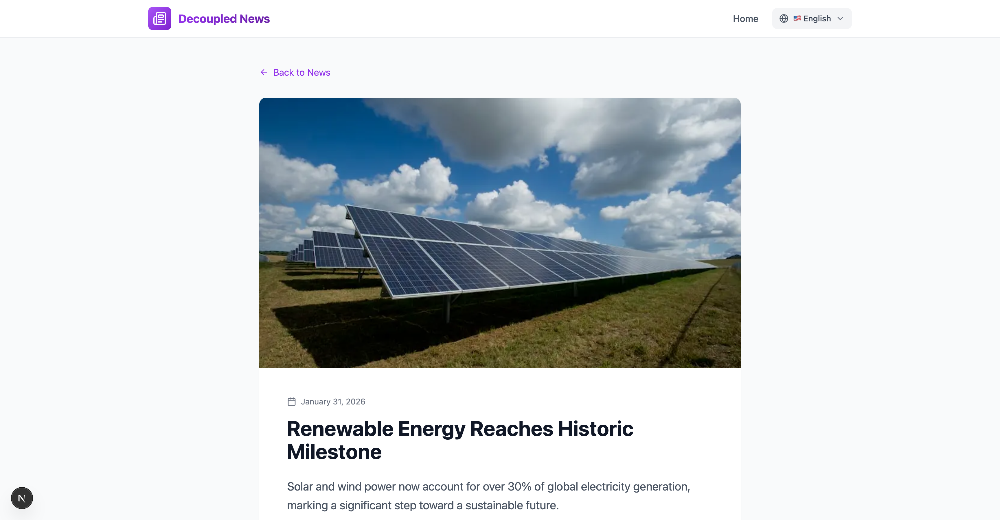

# Decoupled Lang - Multilingual Starter

A multilingual news homepage starter demonstrating translation support with Drupal and Next.js. Features content in **English**, **Spanish**, and **French**.



## Features

- **Multilingual Content** - News articles in 3 languages with language filtering
- **Language Switcher** - Easy language toggle in the navigation header
- **Locale-Based Routing** - Clean URLs: `/en`, `/es`, `/fr`
- **Drupal Backend** - Headless CMS with GraphQL API
- **Next.js Frontend** - App Router with server components
- **Tailwind CSS** - Modern styling with responsive design

### Article Detail Page



## Quick Start

### 1. Install Dependencies

```bash
npm install
```

### 2. Run Interactive Setup

```bash
npm run setup
```

This will:
- Authenticate with Decoupled.io
- Create a new Drupal space
- Configure your environment variables
- Import sample multilingual content

### 3. Start Development Server

```bash
npm run dev
```

### 4. View Your Site

- **English**: http://localhost:3000/en
- **Spanish**: http://localhost:3000/es
- **French**: http://localhost:3000/fr

## Manual Setup

If you prefer manual configuration:

1. Create a space at [dashboard.decoupled.io](https://dashboard.decoupled.io)

2. Copy `.env.example` to `.env.local` and fill in your credentials:
   ```
   NEXT_PUBLIC_DRUPAL_BASE_URL=https://your-space.decoupled.website
   DRUPAL_CLIENT_ID=your-client-id
   DRUPAL_CLIENT_SECRET=your-client-secret
   DRUPAL_REVALIDATE_SECRET=your-revalidate-secret
   ```

3. Import the sample content:
   ```bash
   npm run setup-content
   ```

4. Start the dev server:
   ```bash
   npm run dev
   ```

## Project Structure

```
decoupled-lang/
├── app/
│   ├── [locale]/           # Locale-specific pages
│   │   ├── page.tsx        # News homepage
│   │   ├── [...slug]/      # Article detail pages
│   │   │   └── page.tsx
│   │   └── components/     # Locale-aware components
│   │       ├── Header.tsx
│   │       ├── LanguageSwitcher.tsx
│   │       ├── NewsCard.tsx
│   │       └── SetupGuide.tsx
│   ├── api/                # API routes
│   │   ├── graphql/        # GraphQL proxy
│   │   └── revalidate/     # ISR revalidation
│   └── layout.tsx          # Root layout
├── docs/
│   ├── screenshot-homepage.png
│   └── screenshot-detail.png
├── lib/
│   ├── apollo-client.ts    # GraphQL client
│   ├── queries.ts          # GraphQL queries
│   ├── types.ts            # TypeScript types
│   ├── i18n.ts             # Translations & locale utils
│   └── config-check.ts     # Environment validation
├── data/
│   └── lang-content.json   # Content import (model + sample data)
└── scripts/
    ├── setup.ts            # Interactive setup
    └── generate-schema.ts  # GraphQL schema generation
```

## Content Model

### Language Taxonomy

A vocabulary to categorize content by language:
- English (code: `en`)
- Español (code: `es`)
- Français (code: `fr`)

### News Article

| Field | Type | Description |
|-------|------|-------------|
| title | string | Article headline |
| body | text | Full article content |
| summary | text | Brief teaser text |
| language | term reference | Links to language taxonomy |
| image | image | Featured image |

## Available Scripts

| Command | Description |
|---------|-------------|
| `npm run dev` | Start development server |
| `npm run build` | Build for production |
| `npm run start` | Start production server |
| `npm run setup` | Interactive setup wizard |
| `npm run setup-content` | Import sample content |
| `npm run generate-schema` | Generate GraphQL schema |

## Customization

### Adding a New Language

1. Add the locale to `lib/types.ts`:
   ```typescript
   export type Locale = 'en' | 'es' | 'fr' | 'de' // Add German
   export const locales: Locale[] = ['en', 'es', 'fr', 'de']
   ```

2. Add translations to `lib/i18n.ts`:
   ```typescript
   export const languages = {
     // ... existing
     de: { name: 'German', nativeName: 'Deutsch', flag: '🇩🇪' },
   }

   export const translations = {
     // ... existing
     de: {
       siteName: 'Entkoppelte Nachrichten',
       latestNews: 'Neueste Nachrichten',
       // ... etc
     },
   }
   ```

3. Add content in `data/lang-content.json`:
   ```json
   {
     "id": "lang-de",
     "type": "taxonomy_term.language",
     "values": { "name": "Deutsch", "code": "de" }
   }
   ```

### Styling

Customize the theme in `tailwind.config.js`:
```javascript
theme: {
  extend: {
    colors: {
      primary: {
        // Your custom color palette
      }
    }
  }
}
```

## How It Works

### Language Filtering

Content is filtered by matching the `language` taxonomy field:

```typescript
// In page.tsx
const languageName = languages[locale].nativeName
articles = data.nodeNewsArticles.nodes.filter((article) => {
  return article.language?.some(
    (lang) => lang.name === languageName || lang.code === locale
  )
})
```

### URL Structure

Next.js App Router uses the `[locale]` dynamic segment:
- `/en` → English homepage
- `/es` → Spanish homepage
- `/fr` → French homepage

The root `/` redirects to `/en` (default locale).

## Demo Mode

Demo mode allows you to showcase the multilingual application without connecting to a Drupal backend. It displays sample news articles in all 3 languages.

### Enable Demo Mode

Set the environment variable:

```bash
NEXT_PUBLIC_DEMO_MODE=true
```

Or add to `.env.local`:
```
NEXT_PUBLIC_DEMO_MODE=true
```

### What Demo Mode Does

- Shows a "Demo Mode" banner at the top of the page
- Returns mock news articles in English, Spanish, and French
- Language switching works with sample content
- No Drupal backend required

### Removing Demo Mode

To convert to a production app with real data:

1. Delete `lib/demo-mode.ts`
2. Delete `data/mock/` directory
3. Delete `app/[locale]/components/DemoModeBanner.tsx`
4. Remove `DemoModeBanner` import and usage from `app/layout.tsx`
5. Remove demo mode checks from `app/[locale]/page.tsx`

## Deployment

### Vercel

1. Push to GitHub
2. Import project in Vercel
3. Add environment variables
4. Deploy

Set `NEXT_PUBLIC_DEMO_MODE=true` in Vercel environment variables for a demo deployment.

### Environment Variables

Set these in your deployment platform:
- `NEXT_PUBLIC_DRUPAL_BASE_URL`
- `DRUPAL_CLIENT_ID`
- `DRUPAL_CLIENT_SECRET`
- `DRUPAL_REVALIDATE_SECRET`

## Resources

- [Decoupled.io Dashboard](https://dashboard.decoupled.io)
- [Next.js Documentation](https://nextjs.org/docs)
- [Drupal GraphQL](https://www.drupal.org/project/graphql)

## License

MIT
